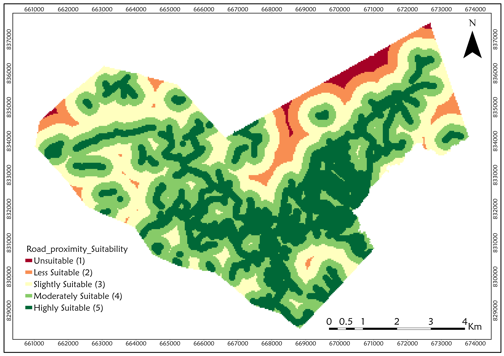
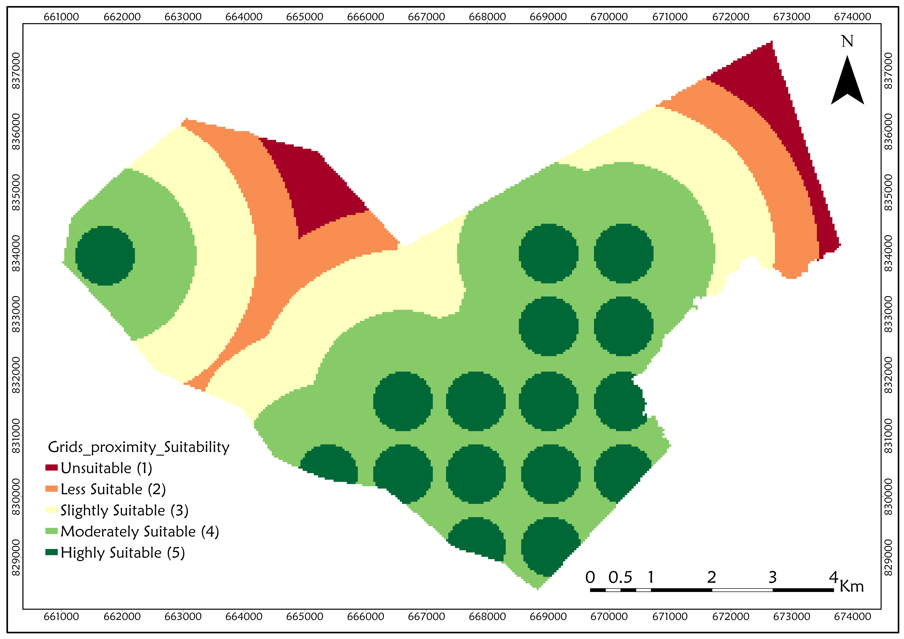

# Solar Farm Suitability Analysis  
**Obafemi Awolowo University, Ile-Ife, Nigeria**  

## Project Overview
Developed a full GIS-based Multi-Criteria Decision Analysis (MCDA) to identify the most suitable locations for utility-scale solar farms within and around Obafemi Awolowo University using **ArcGIS Pro** and the **Analytic Hierarchy Process (AHP)**.

**Key result:** Over **1400 hectares** classified as **Highly Suitable** across the study area — enough for a 300–400 MW solar farm.

## Criteria & AHP Weights
| Criterion                  | Data Source                    | Weight |
|----------------------------|--------------------------------|--------|
| Proximity to Grids         | OpenStreetMap                  | 39%    |
| Land Use / Land Cover      | ESA WorldCover                 | 26%    |
| Proximity to Roads         | OpenStreetMap     	      | 19%    |
| Slope                      | Derived from DSM               | 8%     |
| Aspect 	             | Derived from DSM               | 5%     |
| Elevation                  | Derived from DSM               | 3%     |

## Tools
- ArcGIS Pro 
- Google Earth Engine  
- QGIS (validation)  
- AHP Online System (AHP-OS)
- Weighted Overlay

## Key Maps
  
  
  

*Detailed methodology and full report available on request.*

[Oluwapelumi Hammed]  
GIS & Geospatial Analyst  
LinkedIn • Email • Twitter

---

Open to roles in renewable energy site selection, GIS consulting, and spatial analysis.

